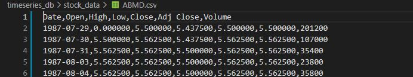

## Generate Data:

For the Generating the Data, we ran in locally on a Windows 10 which had python version 3.10.1.

### Use Miniconda

We used Miniconda download from here https://docs.conda.io/en/latest/miniconda.html. 
Create an environment with name of choice, here we call timescale

```
conda create --name timescale
```

Activate the environment with
```
conda activate timescale
```

On the local machine, we freeze the environment which the dependencies are in requirements.txt.
```bash
pip install -r requirements.txt
```

Set Path ("D:\a_timeseries") to where to download the CSV files to which is at the code of 
```bash
options.set_preference("browser.download.dir", r"D:\a_timeseries")
```
Or you can comment out the lines 31 and 33 which will download to your default Download directory.
We have the line 31 and 33 currently commented out which would download to your default Download directory set in the browser.

In the generate_data folder, we have constituents_csv.csv which contains the Symbols and Names of S&P 500 companies that were downloaded from https://datahub.io/core/s-and-p-500-companies. 

Then, we have a file name done.csv is in the generate_data folder which have the list of symbols which has already been parsed that is output by the get_data.py to make sure if a error occurs we don't redo the symbols that have already been parsed.

In the generate_data folder path run:

```bash
python get_data.py 
```

In the below image, we see that the conda environment as time2, with the command "python get_data.py" ran, which shows that if the company has been parsed, the company symbol, company name, and company sector will be printed out in the screen. "pass signx" is printed which means that the ad pop-up exit logic is not needed for that specific companies page.

.

In the image below, shows FireFox browser with the Yahoo Finance page with A. O. Smith Corporation (AOS) which the Download button will be click by the scraper to download all the known data for that company in which the year that it was added to the public market.


 Yahoo Finance").

If Download to a default directory from the get_data.py, we have to move the files a separate directory which only contains the CSV files, for us, we move the file into the folder in our github repository call stock_data.

After we get the data, we have to add the Symbol column to the CSV file because the file only contains 
Date, Open, High, Low, Close, Adj Close, Volume columns.

To add the symbol column, we run the add_company_column.py which will parse the CSV file as pandas dataframe and add the symbol from the filename that was extracted. Because download file names are named after their unique Symbol like A.csv which the Symbol will be A. Currently we have the file path set to stock_data folder and the after processing, it will replace the file in the stock_data folder.

```bash
python add_company_column.py 
```

Before the running the add symbol column, the data does not have the Symbol column shown below.

.


After running add symbol column, the data will add the symbol column to the end of the data frame shown below in the csv file. 

.


The data that we used is in the stock_data folder which the files are A.csv, ALLE.csv, AAL.csv, AAP.csv, ABBV.csv, ABC.csv, ACN.csv, ADBE.csv, ADI.csv, ADM.csv are used.

## TimescaleDB:

### Set up EC2 instance for TimescaleDB

Use any of the AWS AMI for TimescaleDB EC2 instance, I used the Ubuntu 22, Timescale 2.8.
The instance that was used was is shown in the image below.


.

I selected the t2.micro instance type for the workload 1 and workload 2. Then I launched the instance with default settings and download the key for SSH. 

Connecting to the EC2 Instance is done by clicking on the Connect button on the EC2 dashboard. 
which will show the image below by an example instance which uses the SSH with the key that is generated when launching the instance:

.

Furthermore, you can SSH into the EC2 instance on command line by following https://docs.aws.amazon.com/AWSEC2/latest/UserGuide/EC2_GetStarted.html.


Below image shows copying the command from Connect to EC2 page with the .pem key file.


.

After ssh we want to go to the config directory for PostgreSQL which is /etc/postgresql/12/main/.

```bash
cd /etc/postgresql/14/main/
```

As root user, in postgresql.conf, change "listen_addresses = '*'". You can use sudo nano to change the file.

```bash
sudo nano postgresql.conf
```

.


Any IP Address that is connecting to the EC2 needs to be added which also includes the EC2 IP address that is hosting the TimescaleDB. Also, certain versions of Ubuntu doesn't support scram-sha-256, so you have to change to md5. These edits will happen in pg_hba.conf.

Thus, in pg_hba.conf, add 'host all all "IP-Address / 32" md5' for all things connecting to the EC2.

For example, if I am EC2 instance I am using as client with IP as 121.41.14.14 and the current EC2 IP address as 1.1.1.1 then the below image will be what the final file will be. 

```bash
sudo nano pg_hba.conf
```

.


We also will have to enable md5 in postgresql.conf.

.


Next we want to switch to the postgres user: 

```bash
sudo -u postgres -s
```

Run psql then use 
ALTER USER postgres PASSWORD 'newPassword'; to set a password.
You have to be in the postgres user in bash not the Ubuntu Root.

```bash

psql

ALTER USER postgres PASSWORD '123';
```

.


We can run timescaledb-tune to tune for the VM which needs to run as root user, to exit postgres user, 'exit' command.

```bash
exit

sudo timescaledb-tune
```

We can just press yes for everything.

.


Run sudo service postgresql restart to restart anytime you might have error or change configurations.

```bash
sudo service postgresql restart
```

### timescaleDB settings changed

We changed the max_locks_per_transaction in postgresql.conf from 64 to 1024 and restart postgresql.

max_locks_per_transaction = 1024

Shown in the image below.

.


In AWS EC2: create a security group for PostgreSQL, allowing inbound port 5432 for the EC2.
Here is a tutorial: https://docs.aws.amazon.com/AWSEC2/latest/UserGuide/authorizing-access-to-an-instance.html. 


.


This will log you into postgres user of PostgreSQL with password at port 5432 at code level.


### Set up EC2 Instance for client 

For TimescaleDB Client, a different EC2 was used. For ClickhouseDB and InfluxDB, the client was ran on the same EC2 as the database.

The client was setup with EC2 Instance type of m5a.8xlarge.

https://docs.aws.amazon.com/AWSEC2/latest/UserGuide/EC2_GetStarted.html


First we had install python3 , pip3, git, postgresql-devel and gcc.

```bash
sudo yum install python3-devel pip3 gcc git postgresql-devel
```

Then we install Miniconda.
Install Miniconda or Anaconda on EC2 and Create Conda Environment. Here is Miniconda: https://deeplearning.lipingyang.org/2018/12/24/install-miniconda-on-centos-7-redhat-7/  .  Here's is Anaconda:
https://medium.com/@GalarnykMichael/aws-ec2-part-3-installing-anaconda-on-ec2-linux-ubuntu-dbef0835818a.

```
wget https://repo.continuum.io/miniconda/Miniconda3-latest-Linux-x86_64.sh
sh Miniconda3-latest-Linux-x86_64.sh
```

The miniconda is installed in "/home/ec2-user/miniconda3" location. Enter Yes to install.
Close the Terminal and reconnect and reopen another terminal to have the changes to take affect.


Create a conda environment name "client" and activate the "client".

```bash
conda create --name client
conda activate client
```

Git clone this repository and install the requirements.txt

```
git clone https://github.com/jchen706/timeseries_db.git
cd timeseries_db
pip3 install -r requirements.txt
```

There maybe version errors with numpy and pandas which you can edit the requirements.txt to have to dependency version in them such as numpy being 1.21.6 and pandas being 1.3.5


#### Run all the workloads , this will run all the workloads for timescaledb. May have to comment off workloads as the EC2 instance maybe timeout connection when connecting with another EC2 instance.

You will have to change the password to the password and change the host to the IP address of the EC2 which has the database. You have to have the security group of the EC2 setup to default port 5432. 
If our password is 123, we will have password="123", and if the EC2 IP address of the Database is 18.204.21.200, then host="18.204.21.200".
Change the password="123", host="18.204.21.200", in the ThreadedConnectionPool around line 140-143 as necessary.

For the the workloads, we run them on the command line with their workload id as comman line argument:

Workload Ids:
```
11: Workload 1 is Data Rows Divided by num_workers
12: Workload 1 call Normal Load Data, Using all the stocks data, divided by batches of 1000, 5000,10000 at a time and send them with 1, 5, 10, 20 threads
2: Workload 2
3: Workload 3
4: Workload 4

```

To Run the Client: 

```bash
python3 client.py <Workload ID>
```

To run workload 1 with Data Rows Divided by num_workers, we do 
```
python3 client.py 11
```

To run workload 1 with Normal Load Data, we do 
```
python3 client.py 12
```

To run workload 2:
```
python3 client.py 2
```

To drop the table:
```
python3 client.py 5
```

After running the workloads, the data statistics for the runs are saves as timescaleDB_loadStats.csv for load data statistics and timescaleDB_queryStats.csv for query workload statistics. These files are cleared whenever another run begins.


Statistic column names are 
```
NumWorkers: Number of threads or clients
Batch_Size: Load Size for each thread or client
TotalMetrics: Total number of columns
MetricsPerSec: Number of columns loaded per second
RowsPerSec: Number of rows loaded per second
TotalRows: Total Rows Loaded
TimeStamp: Timestamp
Try: Attempt Number for Load
Latency: Latency for Load
QueryNum: Query Number
Workload: Workload Number
MinLatency: Min Latency
MaxLatency: Max Latency
MedianLatency: Median latency
MeanLatency: Mean Latency
StdLatency: Standard Deviation for Latency
```

### Workloads 1 and Workload 2

Workloads 1 and Workload 2 were run in the t2.micro EC2 instance. 

Workload 1 has the csv column format as 
NumWorkers, Batch_Size, TotalMetrics, MetricsPerSec, RowsPerSec, TotalRows, TimeStamp, Try, Latency .

Workload 2 has csv column format as 
Workload, QueryNum, NumWorkers, MinLatency, MaxLatency, MedianLatency, MeanLatency, StdLatency, TimeStamp 

### Workloads 3 and Workload 4

Workloads 3 and Workload 4 were run in the t2.xlarge EC2 instance. The setup for t2.xlarge is same as setting up for the EC2 for Database from above.

Both workload 3 and workload 4 have same column format as workload 2 as 
Workload, QueryNum, NumWorkers, MinLatency, MaxLatency, MedianLatency, MeanLatency, StdLatency, TimeStamp . 

### DBeaver

A tool that was used was DBeaver for TimescaleDB which when you click  new connect connection, you can select TimescaleDB. 

Below are the connection parameters used for a custom IP address with authentication method selected as private key which is the .pem file downloaded with the EC2 creation. 

You have to add the local IP address to the pg_hba.conf in the configurations of the database in EC2.

.

Below are the connection parameters used for a custom IP address with Host as the IP address and Port set to the default 5432, username and password are needed from the postgreSQL.

.

## ClickhouseDB:

### Install ClickHouse

Add ClickHouse repo
```bash
sudo bash -c "echo 'deb http://repo.yandex.ru/clickhouse/deb/stable/ main/' > /etc/apt/sources.list.d/clickhouse.list"
```
Add key and update repolist
```bash
sudo apt-key adv --keyserver keyserver.ubuntu.com --recv E0C56BD4    # optional
sudo apt-get update
```

Install binaries 
```bash
sudo apt-get install -y clickhouse-client clickhouse-server
```
More details on how to get started with ClickHouse is available [here](https://clickhouse.yandex/docs/en/getting_started/)


Ensure ClickHouse is running
```bash
sudo service clickhouse-server restart
```

### Install Python Dependencies

Install the clickhouse-driver python package
```bash
pip install clickhouse-driver
```

If you need to install pip on EC2, instructions can be found here:
https://docs.aws.amazon.com/elasticbeanstalk/latest/dg/eb-cli3-install-linux.html


### Load Data
The data loading script requires arguments for number of workers to use and csv file to load. Due to column names requiring no spaces, ensure that the "Adj Close" column is reformatted as "Adj_Close" in your input csv. Output metrics are printed to the console.
```bash
python3 load_data_multithread.py [number of workers] [data csv]
```

### Run Workloads
All other workloads are contained in a single script. You must specify how many workers to use. Output metrics are printed to the console.
```bash
python3 workloads_2_3_4.py [number of workers]
```


## InfluxDB:

### Install on AWS EC2

Use the AWS AMI

### In EC 2 Instance, install InfluxDB

wget https://dl.influxdata.com/influxdb/releases/influxdb2-2.5.1-xxx.deb

sudo dpkg -i influxdb2-2.5.1-xxx.deb


### Start Influx service:
sudo service influxdb start

### estart service and ensure it is working: 
sudo service influxdb status

### set up InfluxDB:
influx setup

## Input desired Username, Password, Organization Name, Bucket Name (table name)

Go to http://localhost:8086 

And create the following buckets:
'one_stock'
'five_stock'
'all_stock'
'mini1000'
'mini5000'
'mini10000'


## Now run file in new terminal while Influxdb is running
## in ../influx_db run:
python client.py 


All workloads are included in the script, the metrics are saved to three csv files in the ./influx_db directory.


